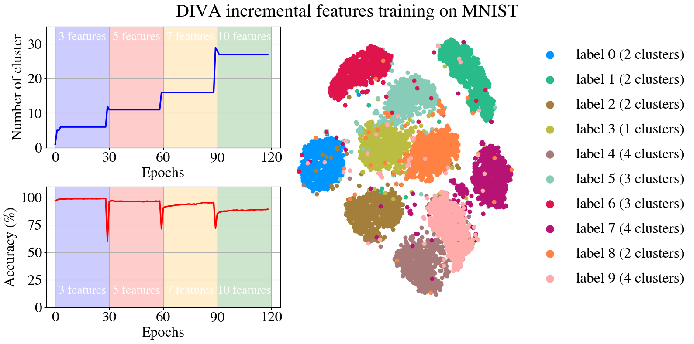

# DIVA: A Dirichlet Process Based Incremental Deep Clustering Algorithm via Variational Auto-Encoder

Implementation of DIVA
<p align="center">

</p>
</img>


## Requirements
we use python 3.7 and pytorch-lightning for training. Before start training, make sure you have installed bnpy package in your local environment, refer to [here](https://bnpy.readthedocs.io/en/latest/) for more details.

- python 3.7+
- bnpy 1.7.0
- pytorch-lightning

## Installation Instructions

```
# Install dependencies and package
pip3 install -r requirements.txt
```

## Detailed Code Structure Overview

```
DIVA
  |- dataset                # folder for saving datasets
  |    |- reuters10k.py     # dataset instance of reuters10k that follows torchvision formatting
  |    |- reuters10k.mat    # origin data of reuters10k
  |- pretrained             # folder for saving pretrained example model on MNIST
  |    |- dpmm              # folder for saving DPMM cluster module
  |    |- diva_vae.pt       # checkpoint file of trained DIVA VAE part
  |- diva.py                # diva implementations for image and text; train manager
  |- main.py                # main entry point of diva training, including evaluation plots.

```

## Load pretrained model
```
# load DPMM module
dpmm_model = bnpy.ioutil.ModelReader.load_model_at_prefix('path/to/your/bn_model/folder/dpmm', prefix="Best") //python

# function for getting the cluster parameters
def calc_cluster_component_params(bnp_model):
        comp_mu = [torch.Tensor(bnp_model.obsModel.get_mean_for_comp(i)).to(device) for i in np.arange(0, bnp_model.obsModel.K)]
        comp_var = [torch.Tensor(np.sum(bnp_model.obsModel.get_covar_mat_for_comp(i), axis=0)).to(device) for i in np.arange(0, bnp_model.obsModel.K)] 
        return comp_mu, comp_var
```